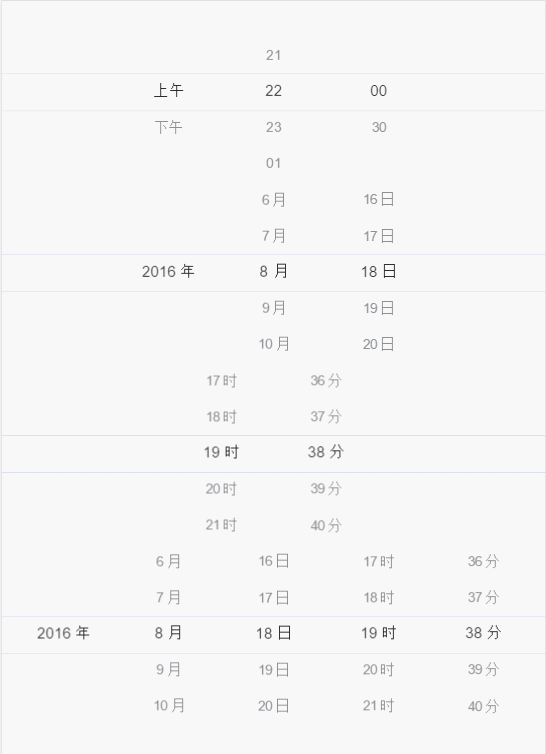
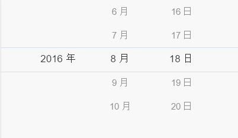
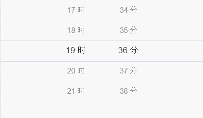
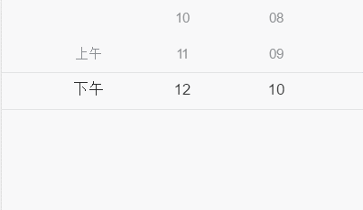
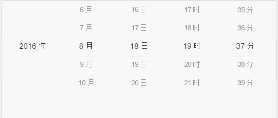

# 日期时间选择器-中文文档

基于javascript的日期时间滑动选择器;
支持**date**,**time**,**datetime**,**diy**模式.

博客教程:

[手把手教你写Js日期时间选择器(1)-基本结构](http://blog.csdn.net/u012963788/article/details/52160333)

[手把手教你写Js日期时间选择器(2)-样式实现](http://blog.csdn.net/u012963788/article/details/52160618)

[手把手教你写Js日期时间选择器(3)-让控件滑动起来](http://blog.csdn.net/u012963788/article/details/52197584)

---
在线演示地址:

[在线演示](http://runjs.cn/detail/zu0k4vkm)

[在线演示全屏](http://sandbox.runjs.cn/show/zu0k4vkm)

[在线调试](http://runjs.cn/code/zu0k4vkm)

##预览.

###全部效果


###日期效果
---


###时间效果
---


###自定义效果
---


###日期加时间
---


##示例

###基本使用
1. 添加样式文件到页面<code>&lt;link rel="stylesheet" href="../dest/datetime.min.css"&gt;</code>
2. 添加脚本文件到页面<code>&lt;script src="../dest/datetime.min.js"&gt;&lt;/script&gt;</code>
3. 在页面添加<code>&lt;div class="ui-datetime" id="datetime"&gt;&lt;/div&gt;</code>
4. 添加如下代码.

```javascript
	var datetime = new DateTime(document.getElementById("datetime"), null);
    datetime.init();
```

---

###jQuery插件使用
1. 添加jQuery依赖.
2. 添加样式文件到页面<code>&lt;link rel="stylesheet" href="../dest/datetime.min.css"&gt;</code>
3. 添加脚本文件到页面<code>&lt;script src="../dest/JQuery.datetime.min.js"&gt;&lt;/script&gt;</code>
4. 在页面添加<code>&lt;div class="ui-datetime" id="datetime"&gt;&lt;/div&gt;</code>
5. 添加如下代码.


```javascript
 $("#datetime2").datetime({
    type: 'date',
    date: new Date(),
    minDate: new Date(),
    maxDate: new Date(),
    onChange: function (data) {
        console.log("call back", data);
    }
});
```


##<span id="options">配置选项</span>

###默认配置

```javascript
{
    type: 'date',
    date: new Date(),
    minDate: new Date(),
    maxDate: new Date(),
    data: [{
        key: 'day',
        resource: ["上午", "下午"],
        value: "上午",
        unit: ''
    }, {
        key: 'hour',
        resource: ["21", "22", "23", "01", "02", "03", "04", "05", "06", "07"],
        value: "22",
        unit: ''
    }, {
        key: 'minute',
        resource: ["00", "30"],
        value: "00",
        unit: ''
    }],
    onChange: function (data) {
        console.log("call back", data);
    }
};
```


###type

String. 默认值:date.

DateTimePicker显示的类型.

接受的值:

* date
* time
* datetime
* diy


###date

Date.默认值:当前日期.

当前选中的值.

###minDate

Date.默认值:当前日期.

开始时间.

###maxDate

Date.默认值:当前日期.

结束时间.


###data

Object.

```javascript
{
    key: 'day',
    resource: ["上午", "下午"],
    value: "上午",
    unit: ''
}
```

* key.
* resource.显示的项
* value. 选中的值
* unit. 单位


###onChange

Function.

回调函数.
当<code>DateTimePicker</code>的选择的值改变时回调此函数.

```javascript
onChange: function (data) {
    console.log("call back", data);
}
```


##方法

###1. constructor

<code>DateTime(ele,options)</code>

* ele:DOM节点
* options: [配置信息](#options)

```javascript
var datetime = new DateTime(ele,options);
```


###2. init

初始化<code>DateTimePicker</code>.

```javascript
var datetime = new DateTime(...);
datetime.init();
```

###3. refreshEventBinder

为<code>DateTimePicker</code>绑定滑动事件.
通常不需要调用此方法;因为在<code>DateTimePicker</code>内部已经调用.
>主要用于组件隐藏或者显示后可能出现事件不响应问题时重新绑定事件.新版本暂未发现此问题.


```javascript
var datetime = new DateTime(...);
datetime.refreshEventBinder();
```

###4. hide

隐藏 <code>DateTimePicker</code>


```javascript
var datetime = new DateTime(...);
datetime.hide();
```

###5. show
显示 <code>DateTimePicker</code>

```javascript
var datetime = new DateTime(...);
datetime.show();
```

##日志

###打开日志
```
LogUtils.enable()
```

###关闭日志
```
LogUtils.disable()
```